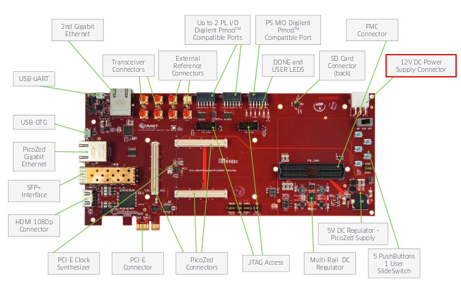

Power-On
========

In order to use the Picozed you have to plugin in it into the carrier board.
Picozed takes the power from the connector *J14* if the carrier board. The board is shipped with an external power adapter.

On connector *J6* you can have the serial console, so, during your daily development use,
you would just connect your workstation to the board using the micro-USB.

.. warning::

  Connect the micro USB only **AFTER** have powered the board.
