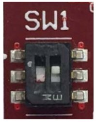

.. warning::

 The following instruction will make you overwrite your SD card content, it will be lost forever!
 If you have important data on it, make sure you do a backup of your data on the SD card before
 catching up with the next steps.

Create two partitions on the SD card you mean to use to boot the board. The first
one has to be a *FAT16* (name it **boot**), 64MB will be more than enough. Create the second
partition as an *EXT2* (name it **rootfs**), make it big enough to fill the free space on the
disk size.

Run this command:

.. raw:: html

 

 
<b class="admonition-host">&nbsp;&nbsp;Host&nbsp;&nbsp;</b>&nbsp;&nbsp;<a style="float: right;" href="javascript:select_text( 'deploy_rootfs_rst-host-111' );">select</a>

 <pre class="line-numbers pre-replacer" data-start="1"><code id="deploy_rootfs_rst-host-111" class="language-markup">mkdir -p /home/architech/Documents/picozed</code></pre>
 
 
 

to create the directory that will be used to save a few files you need to download from the
Internet:

* `Download file uEnv.txt <_static/uEnv.txt>`_

And build by yourself the boot.bin file, see xilinx documentation :ref:`documentation <bootbin_label>`.
Alternatively in the PicoZed flash is present the u-boot that you can use by setting the SW1 switch (on the Picozed) in this way:

Now, we assume that the first partition of the SD card gets mounted (in your SDK virtual machine)
under:

.. raw:: html

 

 
<b class="admonition-host">&nbsp;&nbsp;Host&nbsp;&nbsp;</b>&nbsp;&nbsp;<a style="float: right;" href="javascript:select_text( 'deploy_rootfs_rst-host-112' );">select</a>

 <pre class="line-numbers pre-replacer" data-start="1"><code id="deploy_rootfs_rst-host-112" class="language-markup">/media/boot</code></pre>
 
 
 

while the second partition gets mounted under:sdcard-jumpers.jpg

.. raw:: html

 

 
<b class="admonition-host">&nbsp;&nbsp;Host&nbsp;&nbsp;</b>&nbsp;&nbsp;<a style="float: right;" href="javascript:select_text( 'deploy_rootfs_rst-host-113' );">select</a>

 <pre class="line-numbers pre-replacer" data-start="1"><code id="deploy_rootfs_rst-host-113" class="language-markup">/media/rootfs</code></pre>
 
 
 

.. warning::

 If that's not the case for your configuration, please find out which are the proper mounting points
 for those two partitions on your system and replace them in the following instructions.

Ok then, we can finally deploy bootloader and kernel on the first partition of the SD card:

.. raw:: html

 

 
<b class="admonition-host">&nbsp;&nbsp;Host&nbsp;&nbsp;</b>&nbsp;&nbsp;<a style="float: right;" href="javascript:select_text( 'deploy_rootfs_rst-host-114' );">select</a>

 <pre class="line-numbers pre-replacer" data-start="1"><code id="deploy_rootfs_rst-host-114" class="language-markup">cp /home/architech/Documents/picozed/uEnv.txt /media/boot/
 cp /home/architech/architech_sdk/architech/picozed/yocto/build/tmp/deploy/images/picozed-zynq7/uImage-picozed-zynq7.dtb /media/boot/
 cp /home/architech/architech_sdk/architech/picozed/yocto/build/tmp/deploy/images/picozed-zynq7/uImage /media/boot/</code></pre>
 
 
 

and the root file system on the second partition of the SD card:

.. raw:: html

 

 
<b class="admonition-host">&nbsp;&nbsp;Host&nbsp;&nbsp;</b>&nbsp;&nbsp;<a style="float: right;" href="javascript:select_text( 'deploy_rootfs_rst-host-115' );">select</a>

 <pre class="line-numbers pre-replacer" data-start="1"><code id="deploy_rootfs_rst-host-115" class="language-markup">sudo rm -rf /media/rootfs/*
 sudo tar -xzf /home/architech/architech_sdk/architech/picozed/yocto/build/tmp/deploy/images/picozed-zynq7/core-image-minimal-dev-picozed-zynq7.tar.gz -C /media/rootfs/</code></pre>
 
 
 

.. important::

 sudo password is **architech**

Make sure everything has been written on the SD card:

.. raw:: html

 

 
<b class="admonition-host">&nbsp;&nbsp;Host&nbsp;&nbsp;</b>&nbsp;&nbsp;<a style="float: right;" href="javascript:select_text( 'deploy_rootfs_rst-host-116' );">select</a>

 <pre class="line-numbers pre-replacer" data-start="1"><code id="deploy_rootfs_rst-host-116" class="language-markup">sync</code></pre>
 
 
 

and unmount the SD card from your system.
