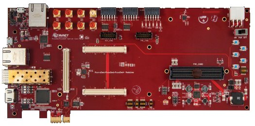
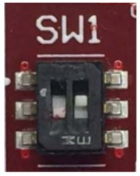

In order to use the Picozed you have to plugin in it into the carrier board.

Make sure that Picozed boot mode SW switches are set like in the following picture:

Insert the SD card you just prepared inside socket **J2** of the carrier board.

Power on the board and **AFTER** connect the micro-USB cable from your PC to Picozed carrier board connector **J6**.

And now proceed by setting up the serial console.

.. include:: serial_console.rst

.. warning::

 The next procedure changes the boot mode of the u-boot. This step is necessary in order to use the files built by Yocto but could make not usable others sd-card built with other SDK.

Before starting to work with the SD-Card built by SDK, it is necessary modify u-boot environment variables.
Turn on the board and before the countdown ends press *Enter* key to stop autoboot. 
Will be shown the u-boot prompt, then insert the following commands:

.. raw:: html

 

 
<b class="admonition-board">&nbsp;&nbsp;Board&nbsp;&nbsp;</b>&nbsp;&nbsp;<a style="float: right;" href="javascript:select_text( 'quick_boot_rst-board-241' );">select</a>

 <pre class="line-numbers pre-replacer" data-start="1"><code id="quick_boot_rst-board-241" class="language-markup">zynq-uboot&gt; setenv uenvboot "fatload mmc 0 0x3000000 uEnv.txt && env import -t 0x3000000 $filesize && run uenv_boot"
 zynq-uboot&gt; saveenv
 zynq-uboot&gt; run uenvboot</code></pre>
 
 
 

.. note::

 | After the first run of picozed you have to stop the boot and give only the third command: **run uenvboot**

Give *root* to the login prompt:

.. raw:: html

 

 
<b class="admonition-board">&nbsp;&nbsp;Board&nbsp;&nbsp;</b>&nbsp;&nbsp;<a style="float: right;" href="javascript:select_text( 'quick_boot_rst-board-242' );">select</a>

 <pre class="line-numbers pre-replacer" data-start="1"><code id="quick_boot_rst-board-242" class="language-markup">picozed-zynq7 login: root</code></pre>
 
 
 

and press *Enter*.

.. note::

 Sometimes, the time you spend setting up minicom makes you miss all the output that leads to the login and you see just a black screen, press *Enter* then to get the login prompt.